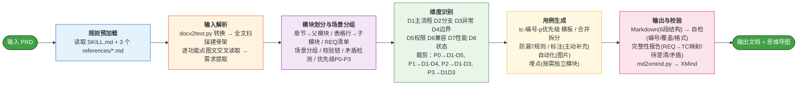

# prd-to-tests-new 技能流程图

```mermaid
graph LR
    START([输入 PRD]) --> S0
    S0["<b>规则预加载</b><br/>读取 SKILL.md + 3 个 references/*.md"] --> S1
    S1["<b>输入解析</b><br/>docx2text.py 转换 → 全文扫描建骨架<br/>逐功能点图文交叉读取 → 需求提取"] --> S2
    S2["<b>模块划分与场景分组</b><br/>章节→父模块 / 表格行→子模块 / REQ清单<br/>场景分组 / 校验链 / 矛盾检测 / 优先级P0-P3"] --> S3
    S3["<b>维度识别</b><br/>D1主流程 D2分支 D3异常 D4边界<br/>D5权限 D6兼容 D7性能 D8状态<br/>裁剪：P0→D1-D5, P1→D1-D4, P2→D1-D3, P3→D1D3"] --> S4
    S4["<b>用例生成</b><br/>tc-编号-p优先级 模板 / 合并拆分<br/>防漏7规则 / 标注(主动补充|自动化|图片)<br/>埋点(按需独立模块)"] --> S5
    S5["<b>输出与校验</b><br/>Markdown(6段结构) → 自检(编号/覆盖/格式)<br/>完整性报告(REQ→TC映射/待澄清/矛盾)<br/>md2xmind.py → XMind"] --> END([输出文档 + 思维导图])

    style S0 fill:#e3f2fd,stroke:#1565c0
    style S1 fill:#fff3e0,stroke:#e65100
    style S2 fill:#f3e5f5,stroke:#7b1fa2
    style S3 fill:#e8f5e9,stroke:#2e7d32
    style S4 fill:#fff8e1,stroke:#f9a825
    style S5 fill:#fce4ec,stroke:#c62828
    style START fill:#43a047,stroke:#1b5e20,color:#fff
    style END fill:#43a047,stroke:#1b5e20,color:#fff
```
