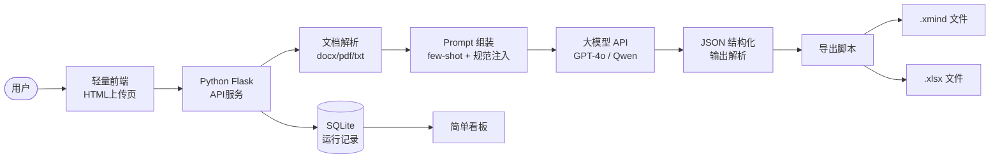
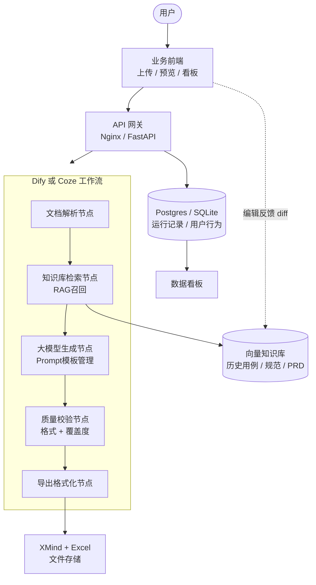
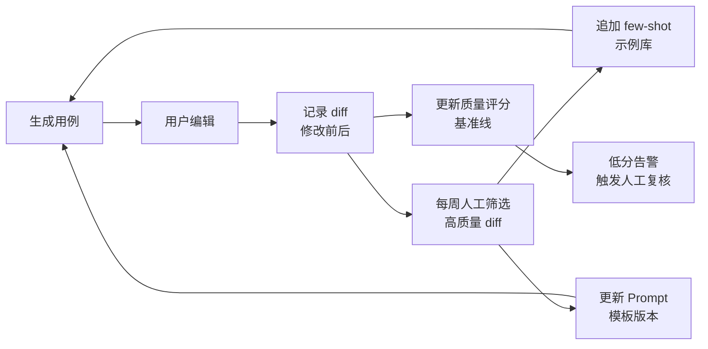
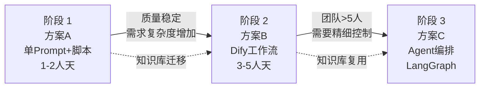

# 用例生成平台 · 架构设计

> 面向小团队的 AI 测试用例生成能力，支持方案 A（单 Prompt）和方案 B（工作流）两条技术路线，可按团队规模和时间成本灵活选择，后续平滑演进至 Agent 编排。

---

## 一、能力全景

```
┌─────────────────────────────────────────────────────────────┐
│                        用例生成平台                          │
├───────────┬──────────────┬──────────────┬───────────────────┤
│  生成向导  │  用例预览编辑 │   数据看板   │   知识库管理       │
│ 物料输入   │  树形结构编辑 │ KPI / 图表  │ 知识/规范/Prompt  │
│ 能力配置   │  版本对比    │ 使用记录    │ 版本管理/上下线    │
│ 执行可视化 │  AI 优化节点 │ 质量趋势    │ 反馈闭环入口      │
└───────────┴──────────────┴──────────────┴───────────────────┘
```

---

## 二、方案 A：单 Prompt + 脚本（1-2 人天）

**适合：** 快速验证、1-2 人小团队、无现成工作流平台



### 工具层（稳定 Function Call）

| 工具 | 实现 | 说明 |
|------|------|------|
| 文档解析 | python-docx / pdfplumber | 提取结构化文本 |
| Prompt 组装 | Jinja2 模板 | few-shot + 规范拼接 |
| 大模型调用 | OpenAI SDK / DashScope | 单次调用，温度 0.3 |
| JSON 校验 | Pydantic | 验证用例结构完整性 |
| XMind 导出 | xmind-sdk | 生成思维导图文件 |
| Excel 导出 | openpyxl | 生成标准用例表格 |
| 记录写入 | SQLite | 运行日志、Token 消耗 |

### 反馈闭环（方案 A）
```
用户编辑用例 → 保存 diff → SQLite 存储 → 每周人工筛选
    → 优质用例追加到 few-shot 示例文件 → Prompt 版本号 +1
```

---

## 三、方案 B：低代码工作流（推荐，3-5 人天）

**适合：** 3-10 人团队、希望自带知识库 RAG、需要可视化调试工作流



### 核心节点说明

| 节点 | Dify 实现 | 职责 |
|------|-----------|------|
| 文档解析 | 代码节点 / HTTP 工具 | 解析上传文档，返回结构化文本 |
| 知识库检索 | 知识库节点（内置 RAG） | 召回业务规则、历史用例、规范文档 |
| 大模型生成 | LLM 节点 + Prompt 模板 | 生成测试用例 JSON |
| 质量校验 | 代码节点 | Pydantic 校验 + 覆盖维度检查 |
| 导出格式化 | HTTP 工具调用外部微服务 | 输出 XMind + Excel |

---

## 四、方案对比

| 维度 | 方案 A | 方案 B | 方案 C（演进） |
|------|--------|--------|--------------|
| 实现成本 | 1-2 人天 | 3-5 人天 | 2-3 人周 |
| 知识库 RAG | ❌ 手动注入 | ✅ 平台内置 | ✅ 自建向量库 |
| Prompt 管理 | Git 管理 | Dify 版本管理 | 自建 Prompt Hub |
| 调用统计 | SQLite 手写 | 平台自带 | 自建 |
| 工作流调试 | 代码调试 | 可视化节点调试 | Agent 轨迹回放 |
| 复杂需求质量 | 中等 | 较高 | 高（多步规划） |
| 自定义扩展 | 容易 | 受平台限制 | 完全自由 |

---

## 五、数据统计能力

### 采集点

```
生成请求触发
  ├─ 输入：用户ID、需求名、文档长度、选中能力、覆盖维度
  ├─ 执行：方案类型(A/B)、各节点耗时、总耗时、Token消耗(输入/输出)
  └─ 输出：用例总数、各优先级分布、质量自评分

用例编辑行为
  ├─ 编辑字段（步骤/预期/优先级）
  ├─ 修改前/修改后 diff
  └─ 保存时间戳、编辑人

导出行为
  └─ 导出格式、导出时间
```

### 质量评分模型

```
质量分 = 
  格式完整度（30%）  → 所有必填字段非空
+ 覆盖完整度（40%）  → 已选维度全部有用例覆盖
+ 人工修改率（30%）  → 用户编辑次数越少分越高
```

### 看板指标

| 指标 | 说明 |
|------|------|
| 累计生成用例数 | 平台总产出量 |
| 月活跃用户数 | 有生成行为的用户 |
| 平均质量分 | 滚动30天均值 |
| 平均耗时 | 端到端生成时间 |
| Token 成本 | 按模型按天统计 |
| 人均生成量 | 衡量平台渗透率 |
| 编辑率 | 用户修改比例，间接反映生成质量 |

---

## 六、持续迭代能力（反馈闭环）



**迭代节奏（小团队建议）：**
- 每周：筛选 10 条高质量 diff，追加 few-shot
- 双周：根据质量分趋势调整 Prompt，版本号递增
- 每月：评估是否需要从方案 A 升级至方案 B 或 C

---

## 七、演进路径



**方案 A → B 迁移成本极低：**
- SQLite 记录直接导入 Postgres
- Prompt 模板直接复制到 Dify
- few-shot 用例批量导入 Dify 知识库
- 前端只需更改 API 请求地址

---

## 八、技术选型汇总

### 方案 B 推荐栈

```
前端:      HTML + Tailwind + Alpine.js（或 Vue3 + Vite）
API 网关:  FastAPI（Python）
工作流:    Dify（推荐）或 Coze
知识库:    Dify 内置（基于 pgvector 或 Qdrant）
导出服务:  Python 微服务（xmind-sdk + openpyxl）
数据存储:  SQLite（小团队）→ Postgres（规模化）
部署:      Docker Compose 单机（4C8G 够用）
```

### 方案 B 目录结构建议

```
usecase-gen/
├── frontend/          # HTML 原型或 Vue 项目
├── api/
│   ├── main.py        # FastAPI 入口
│   ├── routes/        # 生成、导出、统计接口
│   └── models.py      # Pydantic 数据模型
├── export/
│   ├── xmind_gen.py   # XMind 生成
│   └── excel_gen.py   # Excel 生成
├── db/
│   └── schema.sql     # 运行记录表结构
├── prompts/           # Prompt 版本文件（Git 管理）
│   ├── v2.3.j2
│   └── CHANGELOG.md
└── docker-compose.yml
```

---

*文档版本 v1.0 · 2026-05-25*
